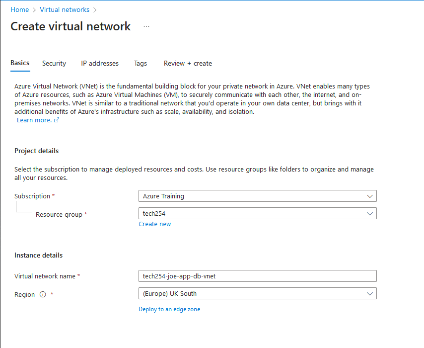
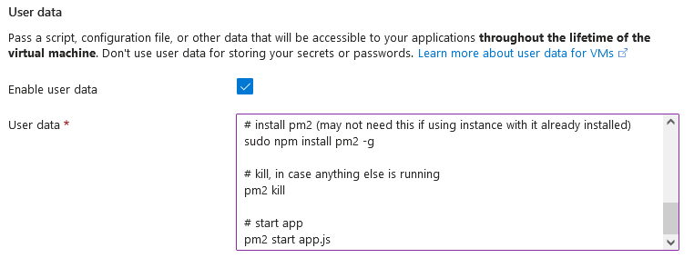

# Overview of Azure

## What's Azure's market share?

Azure had the 2nd highest market share at the close of 2022, with a share of 23%.

## Advantages of cloud

Advantages:

- OpEx over CapEx: You only pay for resources you need, over an entire physical server.
- Can be used to back-up data.
- Can access data on any machine, enhancing mobility.
- Easily scalable with upgrades/downgrades to resources when needed.
- Very secure, with correct use of security groups and keys to restrict access to specific data.
- Enables global reach by deploying images in different regions.
- Easy to keep up with market trends.
- Improved collaboration by working on the same resource group on a single project.
- Economy of scale, big organisations can operate on a larger scale and pass savings on to you/your business.

Disadvantages:

- Data held by third party, requires trust and reputation.
- Difficult to migrate from providers.
- Need internet to access data.
- Subject to data breaches.
- Can lose money if you keep paying for servers you're not using.
- limited control or customisation.
- Data laws differ by country.
- Downtime can affect business.
- Expertise needed.

## Types of services offered by Azure

- AI + machine learning

- Data analytics services

- Compute/virtual machines

- Containers with Kubernetes

- Pre-provided databases

- Developer tools on cloud

- DevOps tools for developing CI/CD pipelines

- Hybrid + multicloud

- Identity management for security

- Cloud integration services

- Automated cloud management services

- Built in media player/encoder

- Migration

- Mixed reality/AR services

- Mobile app supporting services

- Networking

- Security services

- Storage (like buckets)

- Virtual desktop infrastructure for remote working

- Web app tools

## How a virtual machine works

A virtual machine is essentially an emulated computer system that uses virual equivilants of physical components (eg. CPU/storage/etc...) that allows you to run an OS that your current machine isn't using.

# Structure

Resources need to be contained within a resource group.

Resource groups are associated with subscriptions, that limit you on what you can create within resource groups depending on how much you pay.

Management groups can set policies that affect everything below it.
- However, policies can be set at each level too, that filter down to levels below them
- Management groups have layers/levels too

Each of these layers is called a **scope**.


# AWS and Azure differences

- Naming
  - VPC is called virtual network, or vnet in Azure.
  - CIDR blocks are called IPv4 address space
  - Instances are called Virtual machines
  - AMIs are called images
  - Buckets are called containers

- Availability Zones
  - Azure has maximum of 3 AZs per region, where AWS can have more depending on the region
  - In Azure you can select multiple AZs for an instance, which will make a copy per zone selected

# Virtual Networks

## Making the virtual network and subnets

To create one...
1. Search vnet and select virtual network
2. Create virtual network and under basics make sure resource group is tech254 and region is UK South



3. Go to IP adresses tab and make subnets. Make public and private, and choose appropriate CIDR blocks and name. Leave security groups for now.


4. Then we can tag it with our name as owner, for others to know who made this.


## Making the virtual machines

### Client tier

**NOTE:**: In an actual 2-tier virtual network, we will set up the database first. I only go over the client tier first as an example.

5. To make an virtual machine on our virtual network, we go to virtual machines and click create dropdown and the first option.


6. We then select the correct resource group, a good name and AZ 1. 


7. We want ubuntu pro 18.04 LTS generation 2 and security group standard. Double check this is selected, there's a bug that causes this to revert to 20.04.


8. Under size, select see more sizes and B1S.


9. Under administrator account, change the username and under SSH public key source, click use selected key used in azure and select my key.


10. Select HTTP and SSH for selected ports (dont need 3000 as rev proxy works). This is for our app instance so we want these open.


11. Go to disks tab and change OS disk type to standard SSD.


12. Go to networking tab and pick our virtual network, give it a name and tick delete public IP and NIC when VM is deleted.


13. Go to advanced, and select user data then paste it. We are using the following user data like we did in AWS. 

```
#!/bin/bash

#update + upgrade
sudo apt-get update -y
sudo DEBIAN_FRONTEND=noninteractive apt upgrade -y

# get nginx and sed
sudo apt install nginx -y
sudo apt install sed -y

# rev proxy setup
sudo sed -i "s/try_files \$uri \$uri\/ =404;/proxy_pass http:\/\/localhost:3000\/;/" /etc/nginx/sites-available/default

# restart nginx
sudo systemctl restart nginx
sudo systemctl enable nginx

# node install
curl -sL https://deb.nodesource.com/setup_12.x | sudo -E bash -
sudo apt install nodejs -y
npm install

# git install 
sudo apt install git -y

# git clone our app
sudo -u adminuser git clone https://github.com/jbjoeburns/CI_CD.git 

# set DB HOST
export DB_HOST=mongodb://10.0.2.4:27017/posts

# seed db
cd app/app/app
npm install
node seeds/seed.js

# pm2 install
sudo npm install pm2 -g

pm2 start app.js
```



- **NOTE:** It's worth mentioning that `DEBIAN_FRONTEND=noninteractive` needs to be put infront of `apt upgrade -y`. The reason for this is that a certain package installed by default in Azure requires additional configuration on install, that asks for manual user input and interrupts our upgrade progress. As we aren't using this package, we can put this option in to skip over the configuration steps avoiding the user input for increased automation.

14. Go to tags tab and put in owner then our name.


Then we're done! 

**HOWEVER** the user data takes 5-10 mins to run in it's entirety. Give it time to install everything, and if you want to check where in the script it's up to, you can use `<package> --version` to see what has been installed so far.

## Database tier

The set up is almost identical to that of the client tier, with the following changes.

1. In basics, choose a different availability zone, so downtime in the client tier's AZ won't affect the database tier, and vice versa.


2. In networking, make sure public IP is set to none. We do not want a public IP for security reasons, making it so hackers cannot access our database easily. Additionally, we do not need one as the client tier can connect to the database tier through our VN.


3. Still in networking, we want to select **advanced** under NIC network security group, then create new network security group. Then we want to add a new inbound rule with the destination port of 27017, the mongoDB port.


4. Then in advanced, we use the following user data...

```
#!/bin/bash

# update/upgrade
sudo apt update
sudo DEBIAN_FRONTEND=noninteractive apt upgrade -y

# acquire key to mongodb version we want (3.2).
wget -qO - https://www.mongodb.org/static/pgp/server-3.2.asc | sudo apt-key add -

# verify the key.
echo "deb http://repo.mongodb.org/apt/ubuntu xenial/mongodb-org/3.2 multiverse" | sudo tee /etc/apt/sources.list.d/mongodb-org-3.2.list

# update our app list again
sudo apt update

# install mongodb
sudo apt-get install -y mongodb-org=3.2.20 mongodb-org-server=3.2.20 mongodb-org-shell=3.2.20 mongodb-org-mongos=3.2.20 mongodb-org-tools=3.2.20

# edit the config to define what IP we want to be able to connect to the database.
sudo sed -i 's/bindIp: 127.0.0.1/bindIp: 0.0.0.0/' /etc/mongod.conf

# start mongoDB.
sudo systemctl start mongod
sudo systemctl enable mongod
```

# Improve security with networking

### We can further improve the security of our database by changing the networking settings.

The way Azure works is that network settings (security groups) function on a priority system, and will allow for all connections unless told otherwise. Smallest priority numbers are done first.

For example...


This image shows a total of 5 rules, ordered from top to bottom in priority.

1. Azure will check if it's an SSH connection (through port 22).
2. Then it will check if it is a connection through the MongoDB port 27017.
3. Next, it will allow any connections through any ports, provided it is an internal connection from a **source** in the virtual network to another **destination** in the same network.
4. If those aren't passed, it will then allow the connection provided the source is from the internal AzureLoadBalancer.
5. Finally, **the most important rule** if the previous rules fail, then any connection through any port is to be denied.

We can add new rules with the add rule button, and define their priority.

We can also edit rules by double clicking a rule without making a new instance. For example, our MongoDB rule will allow all connections, lets change this to just allow our app instance.

For example, we can change the source to the CIDR range of our client tier.


### We can also remove accidently associated public IPs

If we associate our database tier a public IP by accident, we dont need to create an entirely new instance. However, we can't simply delete the IP, we need to dissociate it with our NIC first, or we'll be told that deletion is not possible.

1. We can just search up the IP on the 'all resources' page.


2. Then click on it, and click dissociate.


3. Now we can safely delete this IP.

# Blob storage

### What is blob storage?

A blob consists of stored unstructured data we can pull for use on azure machines.

You need both a storage account, then a container for your blobs, before you can make any blobs themselves. The storage account belongs to a resource group.


Containers have tiers depending on how frequently they're accessed with, from most accessed to least, they go...

Hot -> Cool -> Archival

The pricing structure for these varies, with hot being cheaper to access, but costing more to keep over a longer period of time. While archival costs a lot of money to access the files, but can be kept to store files for very little money over a long period of time.

Pricing can be further managed by determining if LRS or ZRS is more appropriate for your use.
- LRS: Locally redundant storage. This copies your containers 3 times within a single AZ. This provides backups, but if the zone goes down then the data is inaccessable. **Cheaper**.


- ZRS: Zone redundant storage. Same as LRS but instead each of the 3 copies is located on a different AZ, making it so downtime in one AZ won't affect access to your containers on the other AZs. **More expensive**.


Like with AWS, we need to use a CLI specific for the cloud service we're using to interact with buckets. This is the command to install AzureCLI:
`curl -sL https://aka.ms/InstallAzureCLIDeb | sudo bash`

### Blocker: App is running in the background from launching it with user data, but we want to stop the process to relaunch the app

As the app takes up port 3000, we need to stop it before starting any new app instances. However, as the app was launched by the root user (the user that user data is executed as) we don't see it on `pm2 list` or `top`.

The way we can overcome this is by specifically searching for the process, under all users.

We can do this with `ps aux`.
- `ps` shows running processes
- `a` option shows processes from *all* users
- `u` will show what user ran the process
- `x` will also show processes that aren't attached to a terminal

However, this shows a lot of processes, so to narrow down the ones we're interested in, we can use `grep`.

`grep` will search for keywords
- eg. `ps aux | grep pm2`
- This will show all processes containing the word 'pm2', and we're specifically interested in the one ran by the root user
- Then we can kill the process with `sudo kill <PID>`
- pm2 will re-run the process if we kill node, so that's why pm2 is killed instead

